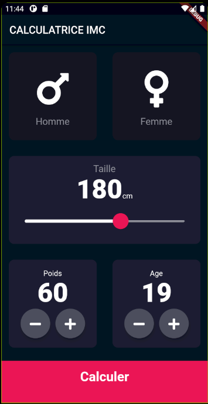
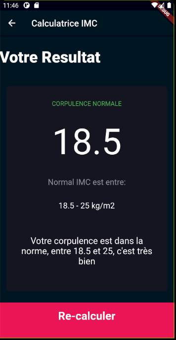

# flutter_calculateur_imc

Calculateur d'indice de masse corporelle. Valable pour l’enfant ou bien l’adolescent, âgé de 0 à 18 ans. 
L’interprétation « classique » du calcul de l’IMC n’étant réservé qu’à l’adulte.  Il est nécessaire d’adopter 
une interprétation différente pour les enfants et les adolescents 

### Compatible Android ou Ios

## Screenshots

### Présentation en images:

### En cours de développement